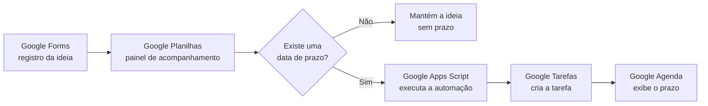

# Fluxo Automatizado de Ideias

Sistema simples para registrar ideias uma única vez e transformar prazos em tarefas automaticamente.

O projeto integra **Google Forms**, **Google Planilhas**, **Google Apps Script** e **Google Tarefas**. A proposta é reduzir anotações espalhadas e evitar o preenchimento repetido das mesmas informações.

## Como funciona



## Recursos

- registro rápido pelo computador ou celular;
- respostas organizadas automaticamente em uma planilha;
- prazo opcional;
- criação de uma tarefa quando a ideia possui data;
- título resumido na tarefa;
- conteúdo completo da ideia nas observações;
- anexos opcionais de imagens, PDFs e documentos;
- tarefa com data, sem transformar o dia inteiro em período indisponível;
- identificação visual com um círculo verde no título.

## Campos sugeridos para o formulário

1. **Ideias** — parágrafo e preenchimento obrigatório;
2. **Tipo de ideias** — caixas de seleção;
3. **Próxima ação** — parágrafo e preenchimento obrigatório;
4. **Data do prazo** — data opcional;
5. **Observações ou links** — parágrafo opcional;
6. **Anexos** — upload opcional de imagens, PDFs ou documentos.

## Estrutura da planilha

Além das colunas criadas pelo formulário, a automação utiliza:

| Coluna | Finalidade |
| --- | --- |
| Status da tarefa | Informa se a ideia está sem prazo, se a tarefa foi criada ou se ocorreu um erro |
| ID da tarefa no Google Tarefas | Permite atualizar a tarefa sem criar duplicatas |

## Instalação

1. Crie um formulário e vincule as respostas a uma planilha.
2. Na planilha, abra **Extensões → Apps Script**.
3. Copie o conteúdo de [`Code.gs`](Code.gs) para o editor.
4. No Apps Script, abra **Configurações do projeto** e ative a exibição do arquivo de manifesto.
5. Substitua o manifesto pelo conteúdo de [`appsscript.json`](appsscript.json).
6. Confira em `CONFIG` o nome da aba de respostas.
7. Execute uma vez a função `configurarAutomacao`.
8. Autorize o acesso solicitado pela Conta Google.
9. Envie uma resposta de teste pelo formulário.

Se o projeto utilizar um projeto padrão do Google Cloud, a API do Google Tarefas também deverá ser ativada no Cloud Console.

## Comportamento da tarefa

Quando uma resposta contém uma data:

- a tarefa é criada na lista **Projetos e publicações**;
- o título recebe o marcador `🟢`;
- o título é limitado a 80 caracteres;
- a ideia completa e os demais dados ficam nas observações;
- a data é registrada como prazo;
- não são adicionados lembretes extras.

Quando não existe data, nenhuma tarefa é criada e a planilha recebe o status **Sem prazo**.

## Personalização

As principais opções ficam no início do arquivo `Code.gs`:

```javascript
const CONFIG = {
  NOME_ABA: 'Respostas ao formulário 1',
  NOME_LISTA_TAREFAS: 'Projetos e publicações',
  LIMITE_TITULO: 80
};
```

Também é possível alterar os nomes dos cabeçalhos aceitos na função `processarLinha_`.

## Privacidade

Este repositório não contém respostas de formulário, links privados, identificadores de planilhas ou arquivos pessoais. Ao adaptar o código, evite publicar dados reais da sua Conta Google.

## Referências oficiais

- [Respostas do Google Forms em uma planilha](https://support.google.com/docs/answer/139706)
- [Serviços avançados do Google Apps Script](https://developers.google.com/apps-script/guides/services/advanced)
- [Gatilhos instaláveis do Google Apps Script](https://developers.google.com/apps-script/guides/triggers/installable)
- [Guia rápido da API Google Tasks com Apps Script](https://developers.google.com/workspace/tasks/quickstart/apps-script)
- [Referência da API Google Tasks](https://developers.google.com/workspace/tasks/reference/rest)

## Contexto

O projeto foi desenvolvido para apoiar a organização de ideias de publicações, projetos acadêmicos e materiais de aula. Seu princípio central é simples: **registrar uma vez e reaproveitar a informação em todo o fluxo**.
