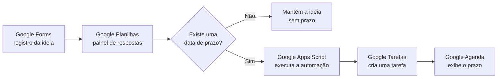

# Fluxo Automatizado de Ideias

Sistema integrado com Google Forms, Google Planilhas e Google Tarefas para registrar ideias em um único lugar e transformar automaticamente os prazos informados em tarefas.

**Versão:** 1.0.0  
**Autoria:** [Monique Eleutério](https://github.com/Moniquetceleuterio)  
**ORCID:** [0009-0009-4167-4101](https://orcid.org/0009-0009-4167-4101)

## Como funciona



Quando o formulário é enviado:

- a resposta é salva na planilha;
- se houver uma data de prazo, uma tarefa é criada na lista **Projetos e publicações**;
- se a data estiver vazia, a planilha recebe o status **Sem prazo**;
- a tarefa aparece no Google Agenda quando a visualização **Tarefas** está ativada.

## Recursos

- formulário de uma única página;
- anexos opcionais de imagens, PDFs e documentos;
- título da tarefa limitado para facilitar a leitura;
- título completo e demais informações mantidos nas observações;
- identificação visual com o símbolo verde `🟢`;
- atualização de uma tarefa já vinculada quando a mesma linha é processada novamente;
- registro do status e do identificador da tarefa na planilha;
- prevenção contra duplicação do gatilho de automação;
- proteção contra observações maiores que o limite aceito pelo Google Tarefas.

## Campos atuais do formulário

1. **Ideia**
2. **Tipo**
3. **Ações**
4. **Data do prazo**
5. **Observações ou links**
6. **Anexar prints, PDFs ou documentos relacionados**

O campo **Data do prazo** é opcional. A automação interpreta a ausência da data como uma ideia sem prazo.

## Estrutura técnica da planilha

Além das respostas do formulário, o código utiliza duas colunas:

- **Status da tarefa** — informa `Tarefa criada`, `Sem prazo` ou a mensagem de erro;
- **ID da tarefa no Google Tarefas** — permite manter o vínculo com a tarefa criada.

Colunas antigas podem permanecer ocultas sem interferir na automação. Quando existem cabeçalhos duplicados, o código considera a primeira ocorrência.

## Instalação

1. Crie um Google Forms e vincule-o a uma planilha.
2. Na planilha, abra **Extensões → Apps Script**.
3. Copie o conteúdo de [`Code.gs`](./Code.gs) para o editor.
4. Em **Serviços**, adicione a **Google Tasks API**.
5. Confirme que o arquivo [`appsscript.json`](./appsscript.json) contém o serviço avançado `Tasks`.
6. Execute manualmente a função `configurarAutomacao`.
7. Autorize o acesso solicitado pelo Google.
8. Envie uma resposta de teste com prazo e outra sem prazo.

## Comportamento da tarefa

A tarefa criada recebe:

- título iniciado por `🟢` e limitado a 80 caracteres;
- prazo de dia inteiro;
- status de tarefa pendente;
- título completo da ideia nas observações;
- tipo, ações, links e anexos, quando informados;
- link para a planilha de respostas.

Como se trata de uma tarefa, ela não bloqueia o dia como indisponível e não recebe lembretes extras pelo código. As notificações seguem as preferências configuradas na Conta Google.

## Personalização

As configurações principais ficam no início de [`Code.gs`](./Code.gs):

```javascript
const CONFIG = {
  NOME_ABA: 'Respostas ao formulário 1',
  NOME_LISTA_TAREFAS: 'Projetos e publicações',
  LIMITE_TITULO: 80,
  LIMITE_NOTAS: 8000,
  COLUNA_STATUS: 'Status da tarefa',
  COLUNA_ID_TAREFA: 'ID da tarefa no Google Tarefas'
};
```

Os nomes alternativos de campos aceitos podem ser ajustados na função `processarLinha_`.

## Limitações conhecidas

- Alterações feitas diretamente em uma linha já registrada na planilha não executam a automação por conta própria.
- O prazo só aparece na Agenda se a visualização **Tarefas** estiver ativada.
- O upload de arquivos exige login em uma Conta Google; os arquivos permanecem no Google Drive da proprietária do formulário.
- A aparência e as notificações das tarefas dependem das configurações pessoais do Google Agenda e do Google Tarefas.

## Privacidade

Este repositório contém apenas o código e a documentação. Ele não publica respostas do formulário, links privados, identificadores da planilha, identificadores de tarefas ou arquivos pessoais.

Ao reutilizar o projeto, evite inserir no repositório dados reais da sua Conta Google.

## Validação

A versão 1.0.0 foi verificada em 18 de julho de 2026 com dois envios controlados:

- um registro com prazo, para validar a criação da tarefa e do identificador;
- um registro sem prazo, para validar o status **Sem prazo**.

## Referências oficiais

- [Salvar respostas do Google Forms em uma planilha](https://support.google.com/docs/answer/2917686?hl=pt-BR)
- [Serviços avançados do Google Apps Script](https://developers.google.com/apps-script/guides/services/advanced?hl=pt-br)
- [Gatilhos instaláveis do Google Apps Script](https://developers.google.com/apps-script/guides/triggers/installable?hl=pt-br)
- [Guia rápido da API Google Tasks com Apps Script](https://developers.google.com/apps-script/advanced/tasks?hl=pt-br)
- [Referência da API Google Tasks](https://developers.google.com/tasks/reference/rest)

## Como citar

Os metadados de citação estão no arquivo [`CITATION.cff`](./CITATION.cff). No GitHub, a opção **Cite this repository** apresenta a referência gerada a partir desse arquivo.

## Licença

Distribuído sob a [Licença MIT](./LICENSE).
